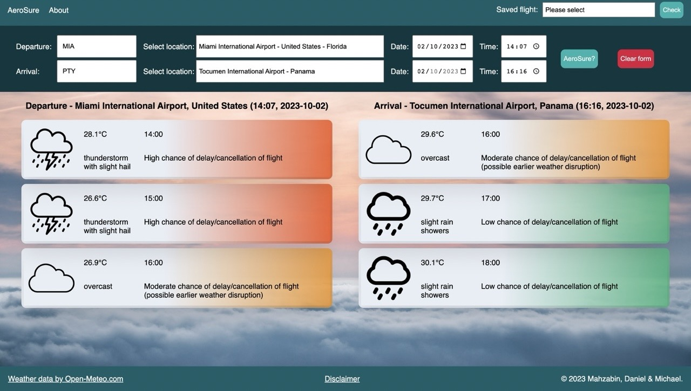
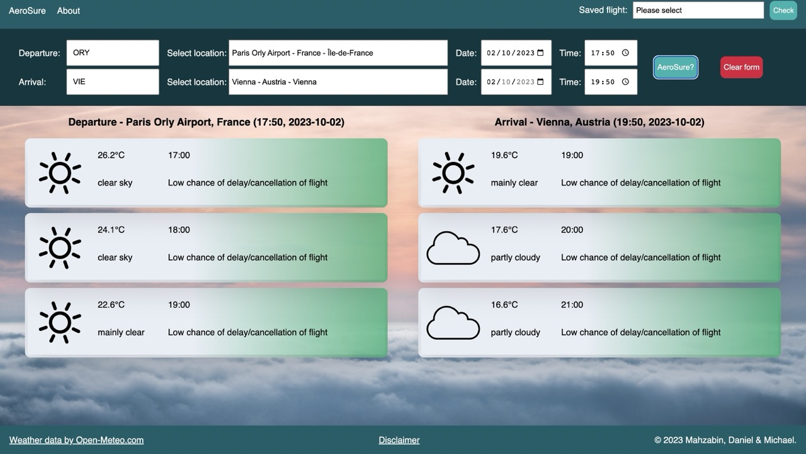

# AeroSure

AeroSure is a React.js app to predict flight disruption due to weather conditions. It was developed as a student project and uses Open-Meteo.com Forecast and GeoLocation APIs (https://open-meteo.com/).

## Overview

The app allows a user to enter the location, date and time of their departure and arrival. The user is then given with the forecast at, and a few hours after, their scheduled departure and arrival. The forecast gives the weather conditions in each hourly window and a simple prediction for any delay/cancellation.

The app is available online (without the back-end functionality to save previous flight searches) at https://mr-mckenzie.github.io/Aerosure.

## Examples

### Example one - high chance of delay/cancellation

In the above flight from Miami to Panama City we can see that the weather conditions are poor in the hour of the scheduled departure (14:00) and for a further hour. Each of these windows has been assigned a high chance of delay/cancellation because of the poor conditions. The weather improves at 16:00 but despite the now-safe take-off conditions, is given a moderate chance of disruption because of the possibility of knock-on delays due to the earlier poor weather. The scheduled arrival time also has a moderate change of disruption due to earlier poor conditions.

We can interpret the forecast as a high possibility of weather-based delay/cancellation for this flight.

### Example two - low chance of delay/cancellation

In this example flight from Paris to Vienna, the conditions at both the departure and arrival locations are clear and we can interpret this forecast as a low chance of any weather-based delay/cancellation.

## Disclaimer

This app is purely an exercise in programming and **should not** be used for predicting any real-life flight delays or cancellations.

We cannot guarantee the accuracy of any predictions made by AeroSure - please **do not** make any decisions based on an AeroSure fligt prediction.

<!-- ## Set-Up

To download and run  your own copy of AeroSure locally, please follow these steps -->